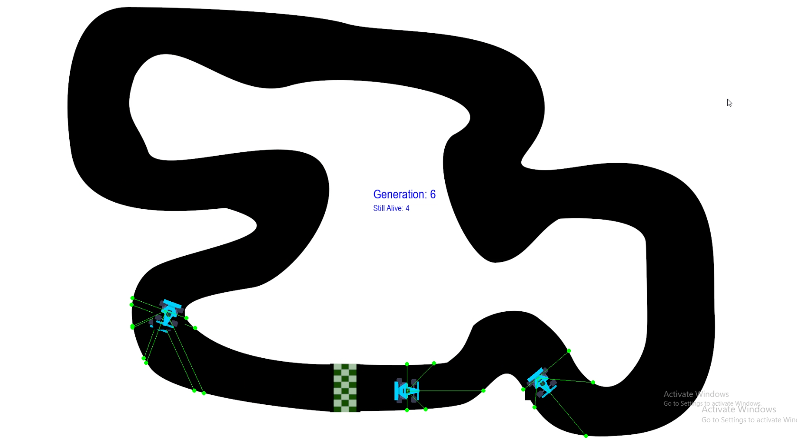
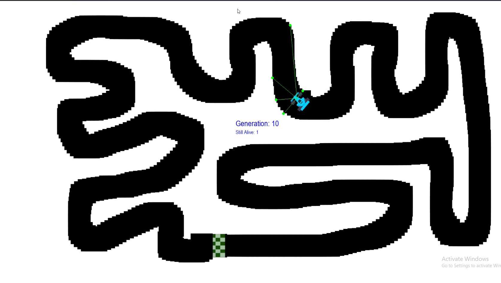

# AI Car Simulation using NEAT

This project implements a **self-driving car simulation** using **NEAT (NeuroEvolution of Augmenting Topologies)** in Python with **Pygame**. The cars learn to navigate a track using radar sensors and evolve their neural networks over generations.  

---


## Overview

This project simulates **autonomous cars** that learn to navigate a track using NEAT, a genetic algorithm that evolves **neural networks** over generations. Each car is controlled by a neural network (genome), which receives sensor data from **radar-like sensors** and outputs driving decisions such as accelerating, braking, or turning.  

Over multiple generations, the best-performing cars propagate their networks, improving their performance and ability to navigate the track.

---

## Features

- **Autonomous Car Simulation:** Cars navigate a track without manual control.  
- **Radar Sensors:** Cars detect obstacles and track borders using multiple rays.  
- **NEAT AI:** Neural networks evolve using **mutation**, **crossover**, and **speciation**.  
- **Dynamic Fitness Evaluation:** Cars are rewarded based on **distance traveled**.  
- **Visual Feedback:** Displays generation number and number of alive cars on screen.  
- **Collision Detection:** Cars stop when they hit the track border.

---

## Technologies Used

- **Python 3.9+**
- **Pygame** - 2D game engine for simulation and graphics.
- **NEAT-Python** - NEAT implementation for evolving neural networks.

---

## Project Structure
```text
ai-car-simulation/
│
├── assets/
│ ├── car.png        # Car sprite image
│ └── map4.png       # Track image
│
├── car.py           # Car class: handles movement, radar, collision, rewards
├── simulation.py    # Runs NEAT simulation with Pygame
├── main.py          # Entry point: initializes NEAT and runs generations
├── config.txt       # NEAT configuration file
└── README.md        # Project documentation
```
---
## Installation

1. Clone the repository:

```bash
git clone https://github.com/AhmedAdelMohamedAbouhussein/AI-car-simulation-using-NEAT.git
cd ai-car-simulation
Create a virtual environment (recommended):
```

```bash

python -m venv myenv
source myenv/bin/activate   # Linux/Mac
myenv\Scripts\activate      # Windows
Install dependencies:
```
```bash
pip install pygame neat-python
```

Running the Simulation
Run the simulation with:

```bash
python main.py
```
The simulation will start in fullscreen mode.

Cars will drive on the track automatically.

## On-screen text shows:

Generation number and Number of cars still alive

NEAT will evolve the neural networks over generations to improve performance.

## How It Works

**1. Car Class**

**Each car has:**
Position, speed, and angle

**Radar sensors:** Five rays detect distance to borders.

**Collision detection:** Stops when hitting the track edge.

**Reward system:** Based on distance traveled.

```python
def get_reward(self):
    return self.distance / (CAR_SIZE_X / 2)
```
**2. Simulation**

Runs one generation of cars.

  **Each car’s neural network outputs one of four actions:**
  
    Turn right
    Turn left
    Slow down
    Speed up

Cars update their position and radar sensors each frame.

Fitness is updated in real-time based on distance traveled.

## NEAT Algorithm

**1. Population:** 30 genomes per generation (configurable)

**2. Neural network:** 5 inputs (radars), 4 outputs (actions)

**3. Fitness:** Maximized using distance traveled

**4. Speciation:** Groups similar genomes to preserve diversity

**5. Mutation:** Adjusts weights, biases, and structure

**6. Crossover:** Combines top-performing genomes for next generation

NEAT configuration is stored in config.txt.
## NEAT Configuration Highlights

```text
activation_default = tanh → Maps inputs to [-1, 1]

num_inputs = 5 → Five radar sensors

num_outputs = 4 → Actions: right, left, slow, speed up

pop_size = 30 → Number of genomes per generation

fitness_criterion = max → NEAT maximizes fitness
```
## Screenshots
<div style="text-align: center;">
  
</div
---
<div style="text-align: center;">
  
</div